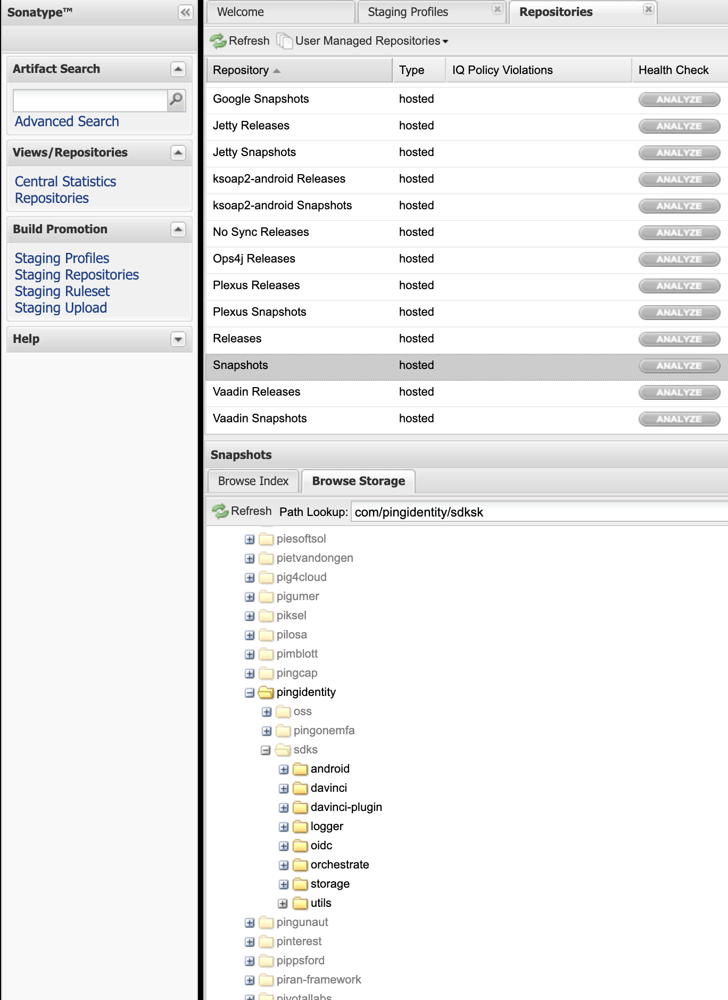
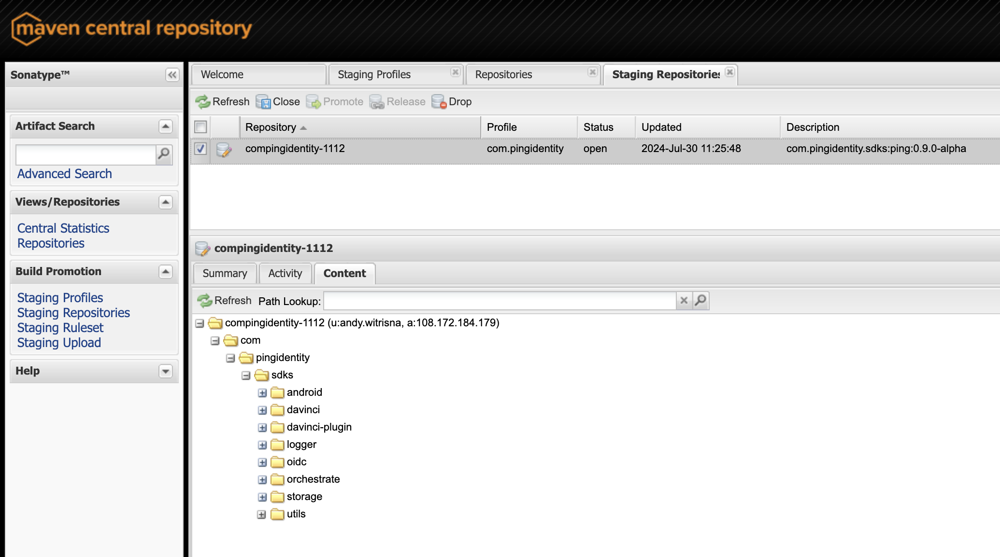

<div>
  <picture>
     
  </picture>
</div>

# Publish Unified SDK Android

## Overview

This document provides the steps to publish the Unified SDK Android to the maven repository.

## Steps to Publish the Unified SDK Android

1. Create an account [Maven Central Repository](https://central.sonatype.com/), DO NOT use Social Login, use
   your `pingidentity` email.
2. Then create a support ticket to [Central-Support](central-support@sonatype.com) and request access to
   the `com.pingidentity` namespace.
3. Central Team will request you get approval from the `Ping Identity` existing publisher. Get approval from the
   existing publisher, and response the ticket.
4. Generate GPG Key
    ```shell
    gpg --gen-key
    ```
5. List the GPG Key `OSS_SIGNING_KEY_ID`
    ```shell
    gpg --list-keys --keyid-format short
    ```
   The output will be like this:
    ```shell
    pub rsa3072/148C566E 2024-07-29 [SC] [expires: 2026-07-29]
    D1D6B2768620AC372617957441DC92EC148C566E
    uid         [ultimate] andy.witrisna <andy.witrisna@pingidentity.com>
    sub rsa3072/70DE30A2 2024-07-29 [E] [expires: 2026-07-29]
   ```
   From above example: `148C566E` is the `OSS_SIGNING_KEY_ID`.

6. Get the staging profile id `OSS_STAGING_PROFILE_ID`, go
   to [Sonatype Staging Profile](https://oss.sonatype.org/#stagingProfiles), click on `com.pingidentity` and get
   the `Profile ID` from the url
    ```shell
    https://oss.sonatype.org/#stagingProfiles;<OSS_STAGING_PROFILE_ID>
    ```

7. Generate base64 gpg key (OSS_SIGNING_KEY)
    ```shell
    gpg --export-secret-keys <OSS_SIGNING_KEY_ID> | base64
    ```

8. Setup Environment Variables

    ```shell
   export RELEASE_TAG_NAME=<Release SDK version, suffix with -SNAPSHOT for snapshot version>
   export OSS_STAGING_PROFILE_ID=<Profile ID, Step 6 above>
   export OSS_USERNAME=<User Token Id>
   export OSS_PASSWORD=<User Token>
   export OSS_SIGNING_KEY_ID=<Signing key id, Step 5 above> 
   export OSS_SIGNING_PASSWORD=<Signing key password>
   export OSS_SIGNING_KEY=<Base64 encoded signing key, Step 7 above>
   ```
   Note: `OSS_USERNAME` and `OSS_PASSWORD` are the `User Token` generated from the `Maven Central Repository` account.
   Refer to the [Generate Token](https://central.sonatype.org/publish/generate-token/) for more information.

9. Publish
    - For local maven (`~/.m2/repository/com/pingidentity/sdks/`)
        ```shell
        ./gradlew publishToMavenLocal
        ```
    - For staging repository (Once downloaded, it stored in `~/.gradle/caches/modules-2/files-2.1/com.pingidentity.sdks/<module>/<version>`)
         ```shell
         ./gradlew --no-configuration-cache publishToSonatype
         ```
      For version with suffix `-SNAPSHOT`, the version will be published to the `snapshot` repository.
      

      For version without suffix `-SNAPSHOT`, the version will be published to the `staging` repository.
      

10. Close and Release the staging repository

## Usage

To use the Unified SDK Android, add the following dependency to your `build.gradle.kts` file:

```kotlin
//implementation(project(":davinci"))
implementation("com.pingidentity.sdks:davinci:0.9.0-SNAPSHOT")
```

You may want to use the local maven OR snapshot repository to test the SDK before publishing to the maven repository.
In the `settings.gradle.kts` file, configure which repository to use:

```kotlin
dependencyResolutionManagement {
    repositories {
        mavenLocal() //For Local Maven
        maven {
            url = uri("https://oss.sonatype.org/content/repositories/snapshots/") //For Snapshot Repository
        }
    }
}
```
