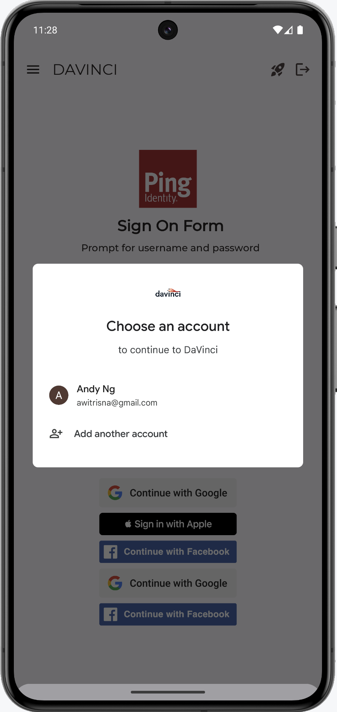

<div>
  <picture>
     
  </picture>
</div>

# Ping External IDP

## Overview

Ping External IDP is a library that allows you to authenticate with External IDP, for example, Google, Facebook, Apple, etc...
This library act as a plugin to the `ping-davinci` and `ping-journey` library,
and it provides the necessary configuration to authenticate with the External IDP.


## Add dependency to your project

```kotlin
dependencies {
    implementation("com.pingidentity.sdks:davinci:<version>")
    implementation("com.pingidentity.sdks:external-idp::<version>")
}
```

## Usage

To use the `enternal-idp` with `IdpCollector`, you need to integrate with `DaVinci` module.
Setup `PingOne` with `External IDPs` and a `DaVinci` flow.

For Browser experience either setup the External IDPs with `PingOne External IDPs` or use the `DaVinci Connector`.
For Native experience the only option is to use the `DaVinci Connector`.

### PingOne External IDPs Setup


### DaVinci Connector Setup


### DaVinci Flow Setup


For the `skIDP`, ensure the `Application Return to Url` configure with the `appRedirectUriScheme` that you setup in the App.
for example:
```kotlin
myapp://callback
```

### App Redirect Uri Setup

In the App `gradle.build.kts` file, add the following `manifestPlaceholders` to the `android.defaultConfig`:

```json
android {
    defaultConfig {
        manifestPlaceholders["appRedirectUriScheme"] = "myapp"
    }
}
```


Here's an example of how to use the `IdpCollector` instance:

```kotlin
var node = daVinci.start()

if (node is ContinueNode) {
    node.collectors.forEach {
        when (it) {
            is IdpCollector -> {
                when (val result = idpCollector.authorize()) {
                    is Success -> {
                        //When success, move to next Node
                        node.next()
                    }
                    is Failure -> {
                        //Handle the failure
                    }
                }
            }
        }
    }
}
```

Simply call `idpCollector.authorize()` method to start the authentication flow with the External IDP,
the `authorize()` will launch a `CustomTab` to authenticate with the External IDP,
once the authentication is successful, it will return a `Success` result,
otherwise, it will return a `Failure`  with `Throwable` which shows the root cause of the issue.

```kotlin
when (val result = idpCollector.authorize()) {
    is SuccessNode -> {
        result.value //This is the continueToken
    }
    is FailureNode -> {
        result.value //This is the Throwable
    }
}
```

### More IdpCollector Configuration

You can customize the `customTab` from `IdpCollector` by using the following methods:

```kotlin
idpCollector.authorize {
    setShowTitle(false)
    setColorScheme(CustomTabsIntent.COLOR_SCHEME_DARK)
    setUrlBarHidingEnabled(true)
}
```

## Native External Identity Providers (IDP) Integration with Google and Facebook for Android



To enhance the user experience when integrating external identity providers like Google and Facebook in your Android application, you can include their native SDKs as dependencies. Once the SDKs are added, the IDP solutions will automatically recognize their presence, allowing the app to deliver a smooth native login experience.
This guide explains how to add the necessary dependencies for both Google and Facebook login and how IDP solutions can automatically detect these SDKs to offer a native experience.

Add Facebook and Google SDKs to Your Project

```gradle
dependencies {
    // Facebook SDK for Android
    implementation("com.google.android.libraries.identity.googleid:googleid:<latest_version>")
    implementation("com.facebook.android:facebook-login:<latest_version>")
}
```

Replace `latest_version` with the latest stable version of the Google & Facebook SDK (e.g., 15.2.0).

### Google Developer Console Configuration

You have to create both credentials: `Client ID for Web application` and `Client ID for Android`, for the External IDP configuration, use the `Client ID for Web application` client ID and client secret.


### Facebook Developer Console Configuration

Follow the direction from the [Facebook Developer Console](https://developers.facebook.com/docs/facebook-login/android) to configure the Facebook SDK.

Make sure you add the `email` and `public_profile` permissions to your Facebook app.


#### String.xml
```xml
    <!-- Facebook Login -->
    <string name="facebook_app_id">[app_id]</string>
    <string name="fb_login_protocol_scheme">fb[app_id]</string>
    <string name="facebook_client_token">[client_token]</string>

```

#### AndroidManifest.xml
```xml

<activity
        android:name="com.facebook.CustomTabActivity"
        android:exported="true">
    <intent-filter>
        <action android:name="android.intent.action.VIEW"/>

        <category android:name="android.intent.category.DEFAULT"/>
        <category android:name="android.intent.category.BROWSABLE"/>

        <data android:scheme="@string/fb_login_protocol_scheme"/>
    </intent-filter>
</activity>

```

